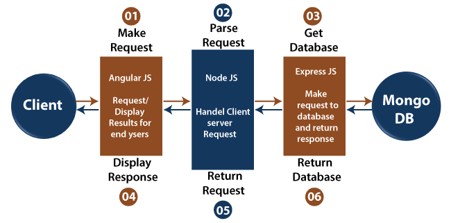

# SKILLS LINK APP

This repository contains a  MEAN (MongoDB, Express.js, Angular, Node.js) stack application. Follow the instructions below to set up and run the app in both development and production environments.

## Prerequisites

- Node.js and npm installed
- MongoDB installed and running

## Installation

1. Clone the repository:

   ```bash
   git clone https://github.com/bmlaghui/skill-link.git
   cd skill-link

### Development Environment

1. Navigate to the server directory:

   ```bash
   cd back

2. Install dependencies:

   ```bash
   npm install  

3. Create a .env file in the server directory with the following content:

   ```bash
   MONGODB_URI='<YOUR MONGODB CONNECTION STRING>'
   APP_BASE_URL = '<YOUR API HOST>' 
   PORT='<YOUR API PORT>'
   SECRET_KEY='<YOUR SECRET KEY>'
   GMAIL_USERNAME='<YOUR GMAIL ADRESS>'
   GMAIL_PASSWORD='<YOUR GMAIL PASSWORD>' *If you are using 2FA authentification with gmail, put the application password*
   APP_NAME = 'SKILLS LINK'

4. Run the server:

   ```bash
   npm run dev

## Architecture

